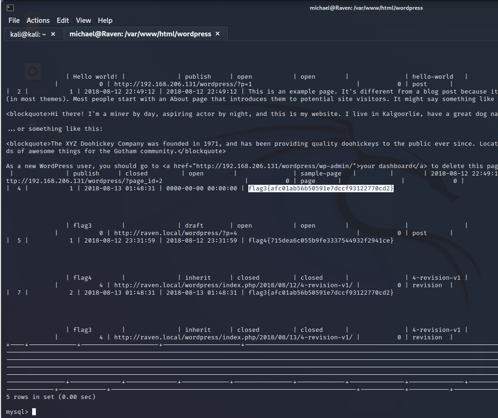

# 实验个人记录

## kali机

- ip: 192.168.223.129
  - 发现靶机IP地址:利用nmap工具,
                    扫描网段
                    nmap -sn 192.168.223.0/24
                    发现raven靶机的地址为:192.168.223.132
                    扫描开放端口
                    nmap -A 192.168.223.132 -p 0-65535
                    发现22 80 111 3306端口开放

### 渗透

- 查看端口找信息:
  - 80:访问一下端口
    - 是一个网页
    - 目录爆破情况:
    - 在80端口网页中,在菜单栏中service的标签页面源码中发现flag1,然后还发现标签页blog页面没有正常跳转;
    - flag1:
    - 查看blog页面为
    - 使kali主机拥有访问该目录权限:  
    - 使用下面的命令来扫描wordpress站点并列出用户名等
    - wpscan --url <http://192.168.223.132/wordpress> --wp-content-dir -ep -et -eu
        发现两个用户michael,steven
    - echo -e  "michael\nsteven" > user.txt,修改用户目录
  - 22端口:
    - 利用破解工具破解22端口,建立ssh连接`hydra -L user.txt -P rockyou.txt 192.168.233.132 ssh`
    - 
    - michael@192.168.223.132 ssh
    - 登录到raven靶机
    - 
    - 在靶机raven中试着查找flag
    - 
    - 
    - mysql的账号密码:
    - 在数据库表中选择wordpress库,在wp_posts中找到flag3,flag4;
    - 
    - 

## 个人总结

- 在本次渗透靶机的实验中,学到了一些破解工具例如nmap,WPScan(是一个kali linux的一款扫描wordpress漏洞的扫描工具),了解到wordpress漏洞等等,这些内容令我的网安技术得到补充与验证,面对一个未知的靶机进行探索,一步一步的找flag的过程让自己沉醉.
